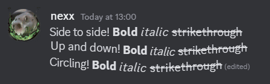
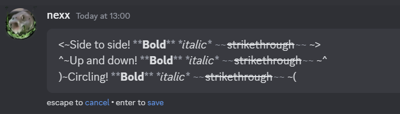

# Wiggly Text

Adds a new markdown formatting that makes text wiggly. Inspired by [GDColon's Tweet](https://x.com/TheRealGDColon/status/1811953446330777683)

|  |  |
| ------------------------------------------------------------ | -------------------------------------------------------- |
| Showcase of all wiggle directions                            | Source of the showcase message                           |

## How to use

You can make text wiggle in 3 directions:

- Horizontal — `<~Text~>`
- Vertical — `^~Text~^`
- Circular — `)~Text~(`

## Installation

Install using the official [Vencord documentation](https://docs.vencord.dev/installing/custom-plugins/)

  
OR...

  
  Use [Equicord](https://github.com/Equicord), a fork of Vencord, which has the plugin built-in!

